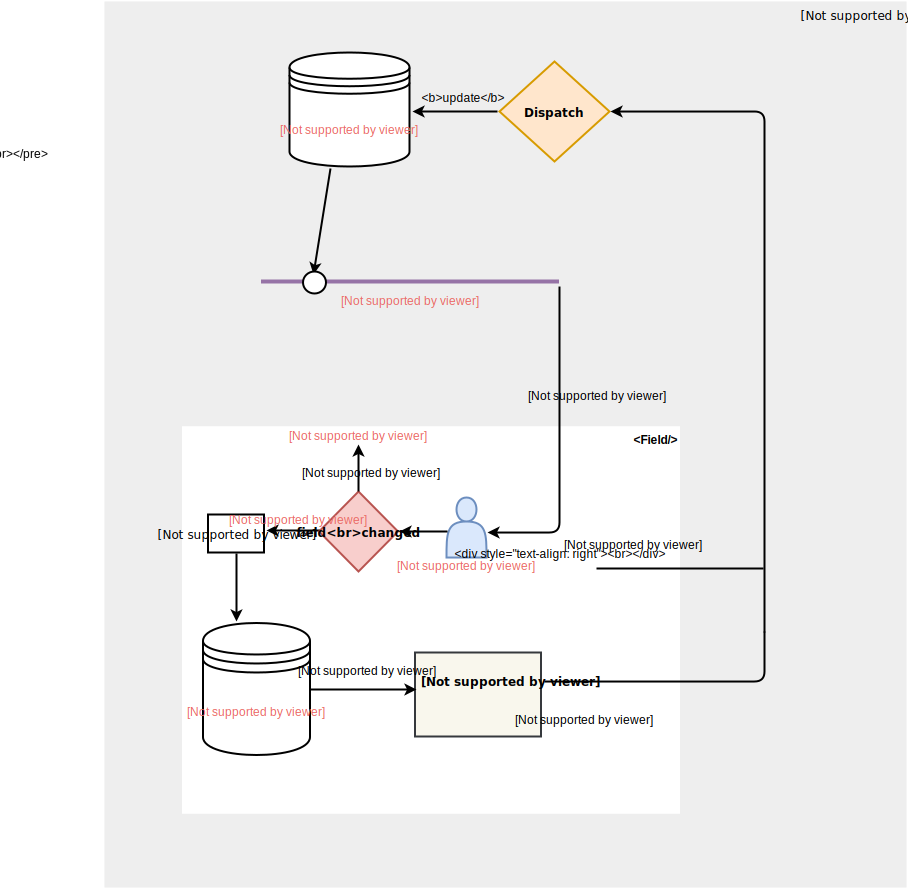

# React Rx Form

### Install

`npm install @react-rx/form`

### Usage

```ts
import React, { Component } from "react";
import { Field, RxForm } from "@react-rx/form";

export class ContactForm extends Component {
  onSubmit = (formValues: any) => {
    console.log(formValues);
  };

  render() {
    return (
      <RxForm>
        {({ handleSubmit }) => (
          <form onSubmit={handleSubmit(this.onSubmit)}>
            <Field name="firstName">
              {({ value, onChange }) => (
                <input value={value} onChange={onChange} type="text" placeholder="First Name" />
              )}
            </Field>
            <button type="submit">Submit</button>
          </form>
        )}
      </RxForm>
    );
  }
}
```
## Examples

Please check more examples [here](http://react-rx-form.surge.sh).

## API

### `RxForm`

The Form component which maintain all fields state.

- `initialValues: { [fieldName: string]: TFieldValue }`

  Form initial values.

- `children: (props) => ReactNode`

  A render prop, which provide the following props to it's children:

  - `handleSubmit: (onSubmit: TOnSubmit) => (formEvent: React.FormEvent) => any`

  - When `handleSubmit` function fired, `onSubmit` will be called with the following parameters: 
 	 - `values: { [fieldName: string]: TFieldValue }`
 	 - `onSubmitError: (errors: { [fieldName: string]: TErrorMsg }) => any`

### `Field`

The Field Component is connect each individual input to RxForm.

- `name: string`
  
  Field name
  
- `children: (props) => ReactNode`

  A render prop, which provide the flowing props to it's children:

	- `name: string`
	- `onChange: (value: React.MouseEvent | TFieldValue) => void`
	- `onBlur: (value: React.MouseEvent | TFieldValue) => void`
	- `onFocus: () => void`
	- `value?: TFieldValue`
	- `meta`
	  - `dirty?: boolean`
	  - `touched?: boolean`
	  - `visited?: boolean`
	  - `error?: TErrorMsg`

- `defaultValue?: TFieldValue` 
	
	Field default value
	
- `validate?: TValidator | TValidator[]`
	- TValidator is a function which returns error message based on field value. 
		- `(value: TFieldValue) => string | undefined` 
	- Default be called when field `onChange` and form `startSubmit`

- `format?: (value: TFieldValue) => TFieldValue`
  
  Format field value to be displayed in field input. For example, we can format number to currency. Should be used with `parse` in pairs.
  
- `parse?: (value: TFieldValue) => TFieldValue`
  
  Parse field input display value to be stored in RxForm. Should be used with `format` in pairs.
  
- `destroyValueOnUnmount?: boolean` 

 	When field unmount, determine whether to destroy the field value or not.
 	
### `FieldArray`

 - `name: string`
	 - 	Field array name.
- `children: (props) => ReactNode`
	 
	 A render prop, which provide the flowing props to it's children:
	 
	- `add: () => any`
		- Add an item to the end of the array.
	- `remove: (idx: number) => any`
		- Removes an item from the array by index.
	- `each: (mapper: (fieldName: string, idx: number) => React.ReactNode) => React.ReactNode`
		- A method to iterate over each value of the array.
 - `initLength?: number`
	 
	 The init length of the array.
	 
### `FormSection`

The FormSection component makes it easy to split forms into smaller components that are reusable across multiple forms. It does this by prefixing the name of Field, FieldArray children, at any depth, with the value specified in the name prop.

-  `name: string`

	The name all child fields should be prefixed with.
	
-  `children: React.ReactNode`
	 
### `FormValues`

The FormValues component provides form values to it's children.

- `children: (props) => ReactNode`

	A render prop, which provide the flowing props to it's children:
	
	- `formValues: { [fieldName: string]: TFieldValue }`
   - `updateFormValues: (formValues: IFormValues) => any`

### `WithForm`

The WithForm components provide form context to it's children.

- `children: (props) => ReactNode`

	A render prop, which provide the flowing props to it's children:

  - `dispatch: (fieldAction: IFieldAction) => any`
  - `subscribe: (observer: Observer<any>) => any`
  - `subscribeFormAction: (observer: Observer<any>) => any`
  - `updateFormValues: (formValues: IFormValues) => any`
  - `getFormValues: () => IFormValues`
  - `getFormState: () => IFormState`
  - `fieldPrefix?: string`
  - `setErrors: (errors: TErrors) => any`


## Data Flow


